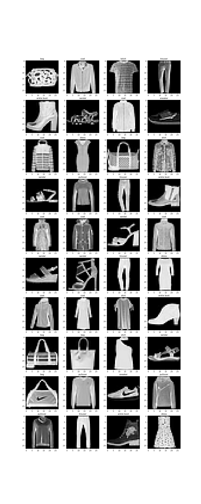

# Deep learning Ex2 report

Ariel Radomislensky 211991146

## visualization

##Logistic Regression
In testing various configurations for batch size, learning rate, and regularization coefficient, the following insights were observed:
### Batch Size:
Smaller batch sizes (e.g., 10) led to noisier gradients but potentially faster convergence.
Larger batch sizes (e.g., 100) provided smoother convergence but at the cost of slower updates and higher computation per epoch.
### Learning Rate:
A lower learning rate (e.g., 0.0001) led to stable but slower convergence, often failing to reach optimal performance within limited epochs.
A higher learning rate (e.g., 0.1) caused divergence in some cases, especially without proper regularization.
An intermediate learning rate (e.g., 0.001) struck the best balance for most configurations.
### Regularization Coefficient:
A moderate regularization coefficient (e.g., 0.01 for L2 regularization) improved generalization and reduced overfitting.
A very high coefficient (e.g., 0.1) significantly restricted the model's ability to fit the data, leading to underfitting.
The best performance was observed with a batch size of 100, a learning rate of 0.001, and an L2 regularization coefficient of 0.01. Loss and accuracy curves showed a smooth convergence, with validation loss closely tracking the training loss.

### LR loss curve

### LR accuracy curve

## Neural Network
The neural network model with one hidden layer was tested for various configurations of hidden layer sizes, activation functions, batch sizes, learning rates, regularization coefficients, and dropout rates. Key findings are as follows:

### Hidden Layer Size:
A hidden layer size of 512 provided a good balance between expressiveness and computational efficiency.
Larger sizes marginally improved performance but increased training time and risked overfitting.
### Activation Functions:
ReLU consistently outperformed other activation functions (e.g., sigmoid, tanh) in terms of convergence speed and accuracy.
### Batch Size:
Similar to logistic regression, a batch size of 100 provided a good trade-off between convergence stability and training time.
### Learning Rate:
The optimal learning rate was observed to be in the range of 0.001 to 0.005. Rates outside this range either caused slow convergence or instability.
### Regularization Coefficient:
L2 regularization with a coefficient of 0.001 to 0.01 improved generalization.
Higher coefficients overly constrained the model, reducing its ability to capture data complexity.
### Dropout:
Applying dropout with a rate of 0.001 the hidden layer significantly improved robustness by preventing overfitting.
Dropout rates beyond 0.01 led to underfitting.
The best configuration utilized a hidden layer of size 512, ReLU activation, a batch size of 100, a learning rate of 0.001, L2 regularization with a coefficient of 0.001, and dropout with a rate of 0.001. The model demonstrated smooth training and validation loss curves, with the gap between the two minimized, indicating strong generalization.

### NN loss curve

### NN accuracy curve
